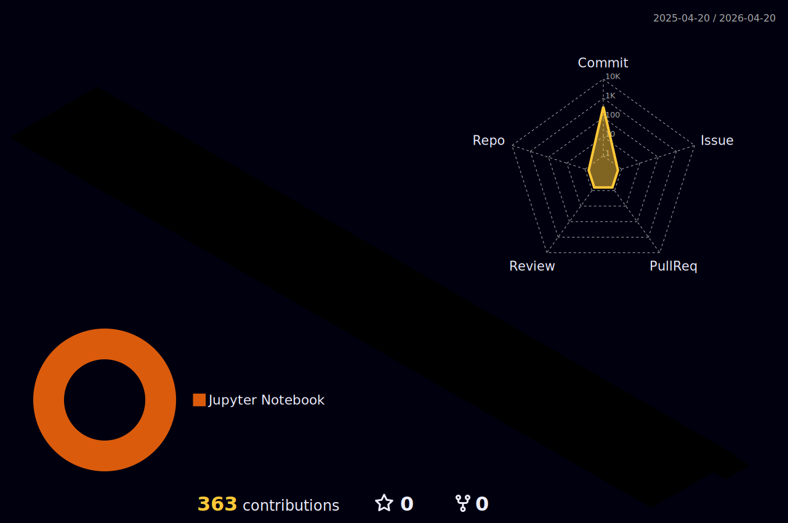

# WASSUP 👋 
## 이스트소프트 AI 서비스기획 KDT 과정 1기

	

## Hi, I'm Jun, who will be a product manager

	

### Let me introduce myself

	- I'm currently working on ...
	- I'm currently learning ...
	- I'm looking to collaborate on ...
	- I'm looking for help with ...
	- Ask me about ...
	- How to reach me: ...
	- Pronouns: ...
  

 

	
🎨 SNS & Portfolio 🎨

 

	
🛠 Tools 🛠

    